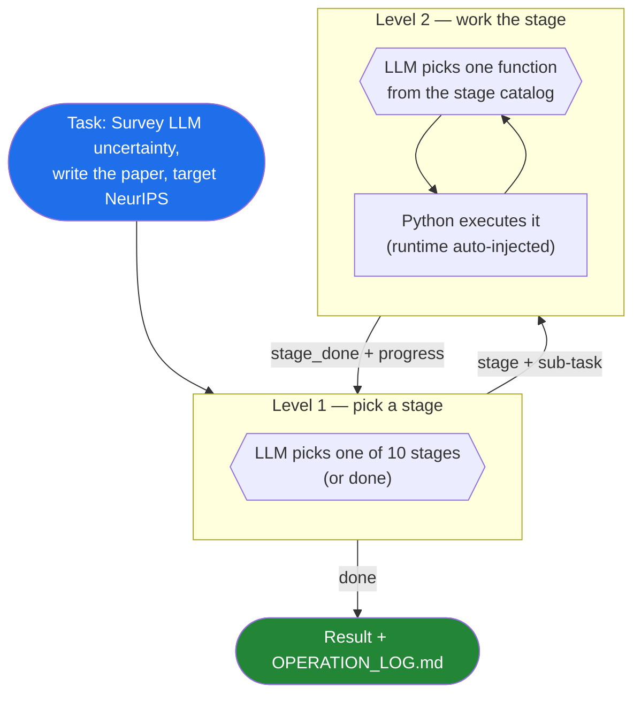
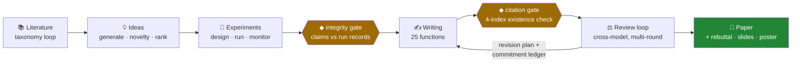
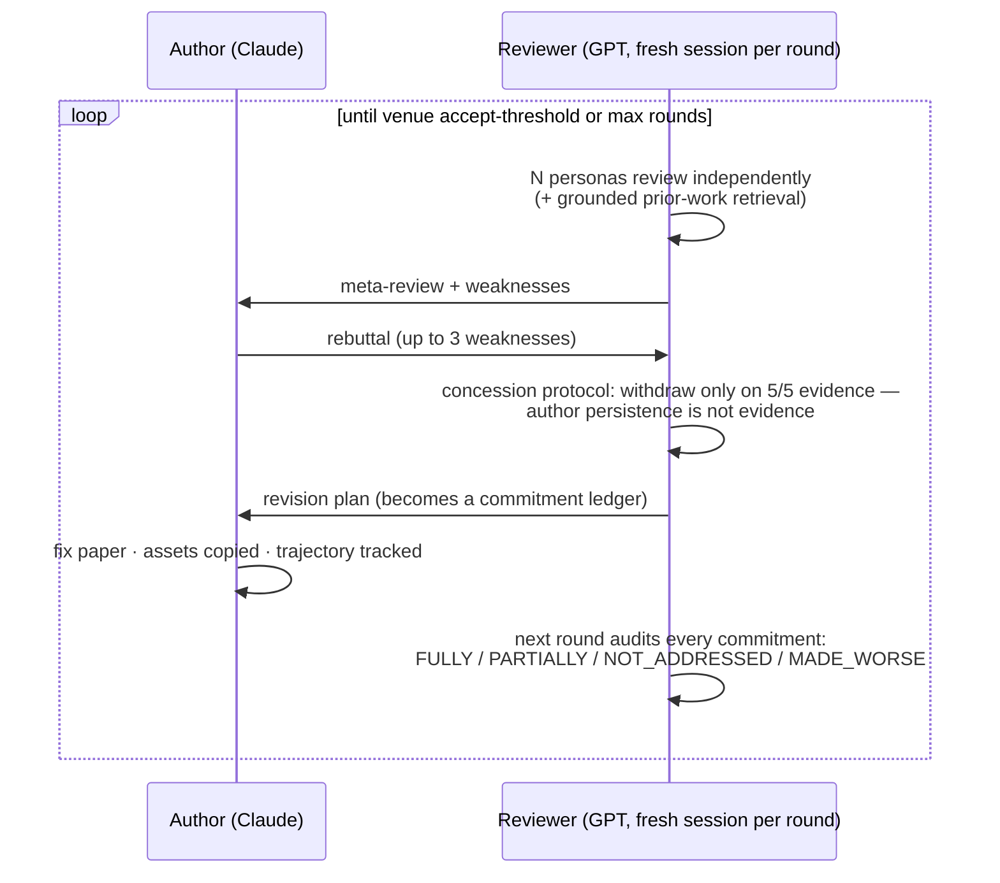

# Research Agent Harness

**An autonomous research agent that takes a topic to a submission-ready paper — and doesn't trust itself.**

[](https://github.com/Fzkuji/Research-Agent-Harness/releases)
[](tests/)
[](pyproject.toml)
[](#license)
[](https://github.com/Fzkuji/OpenProgram)

Built with [OpenProgram](https://github.com/Fzkuji/OpenProgram) (*Agentic Programming*): **Python controls the workflow, the LLM provides the judgment** — 89 functions across 10 research stages, with a deterministic verification layer standing between the model and your paper.

> **This harness is an OpenProgram program — it runs *inside* OpenProgram.**
> Install OpenProgram first, then add this harness to it.

---

## Why this harness

- ⚖️ **Adversarial by construction** — your paper is written by one model (Claude) and reviewed by a *different* one (GPT via Codex). No self-grading. The reviewer keeps memory across rounds, debates the author under a strict concession protocol, and audits whether promised revisions actually happened.
- 🔍 **Trust-but-verify, deterministically** — fabricated citations are caught by *code, not vibes*: every BibTeX entry is checked against four bibliographic indexes (Crossref / OpenAlex / Semantic Scholar / arXiv). Quantified claims without citations, citation-dump abuse, and paper numbers with no experiment provenance are flagged by pure-Python lints and gates.
- 🗣️ **Dialogue when you want it, autonomy when you don't** — `--chat` starts a Socratic planning mentor that asks you one question at a time until your research plan converges, then hands the brief to the autonomous run. Same framework, no slash commands.
- 🧠 **9-persona review panel** — empiricist, theorist, novelty hawk, methodologist, statistician, reproducibility auditor, devil's advocate, clarity critic, balanced — each a concrete, checkable lens, not a costume.
- 🧰 **Everything is an editable function** — every step is a plain Python file whose docstring *is* the prompt. Open it, read it, change it. No hidden chains.
- 📜 **Everything leaves a trace** — operation log, cumulative review log with full transcripts, PRISMA flow report computed from the literature loop's real ledger (every number auditable), commitment ledgers, integrity reports.

## How it works

Two nested decision loops. Python owns the structure; at each step the LLM picks **one** option from a menu (OpenProgram's [next-step decision](https://github.com/Fzkuji/OpenProgram/blob/main/docs/design/runtime/next-step-decision.md) — `exec(choices=...)`), and the framework executes the pick:



Misbehavior is handled by *code*: an unparseable pick is retried once and then fails loudly (never silent success), a model that re-picks the same function with the same arguments is warned and then cut off, and human-in-the-loop functions are hidden from the autonomous catalogs by oversight metadata.

## The pipeline, with its checkpoints

The full run is a research pipeline where **deterministic verification gates (◆) stand between the LLM stages**:



| Checkpoint | What it catches | How |
|---|---|---|
| `integrity_gate` | Paper numbers with no experiment behind them | Audits every empirical claim against machine-readable `run_record.json` provenance: ALIGNED / OVERSTATED / NOT_SUPPORTED / NO_PROVENANCE |
| `verify_citations` | Fabricated references | DOI/arXiv-ID resolution against Crossref + OpenAlex + Semantic Scholar + arXiv, 3-class verdicts, SQLite-cached. A bogus DOI is hard evidence; a title-only miss is only advisory |
| `uncited_assertion_check` | "improved by 23%" with no citation or own-result reference | Pure-regex LaTeX lint, zero tokens |
| `citation_context_check` | Citation dumps, `\cite`-as-noun misuse, cargo-cult cites | Pure-regex LaTeX lint, zero tokens |
| repetition guard | A stage spinning on identical calls | Loop-level cutoff with a logged reason |

## The review loop (ARIS design, upgraded)



Three protocols keep multi-round review honest (all enforced in code, adapted from [ARS](https://github.com/Imbad0202/academic-research-skills) protocol specs):

- **Concession threshold** — a weakness is withdrawn only when the rebuttal scores 5/5 on evidence; after any concession the bar rises. Pressure doesn't move scores.
- **Commitment ledger** — every revision-plan item is re-audited next round; unaddressed items are carried forward verbatim and cannot silently drop.
- **Score trajectory** — per-dimension deltas across rounds; a regression (e.g. soundness fell while presentation rose) is flagged and fed back to the author model.

Difficulty controls information asymmetry: **medium** (author curates what the reviewer sees) → **hard** (+ reviewer memory & debate) → **nightmare** (reviewer reads the repo itself; the author can hide nothing).

## Quick Start

### 1. Install

```bash
# 1. Install the OpenProgram host (one command)
git clone https://github.com/Fzkuji/OpenProgram && cd OpenProgram
./scripts/install.sh            # Windows: .\scripts\install.ps1

# 2. Add this harness — clones it into OpenProgram's functions/agentics/
#    and installs its deps. The first-run wizard also offers this.
openprogram programs install research
```

Restart OpenProgram and `research_agent` appears in the Functions page / chat. That's the whole install.

<details>
<summary><b>How OpenProgram detects this harness (and how to build your own)</b></summary>

OpenProgram walks `openprogram/functions/agentics/` at startup and loads
any cloned repo that satisfies the harness contract:

```
Research-Agent-Harness/              ← cloned into functions/agentics/
├── pyproject.toml                   ← declares THIS repo's own deps only
└── research_harness/                ← importable package
    ├── __init__.py                  ← kept dependency-light
    └── agentics/
        └── __init__.py              ← exposes AGENTIC_FUNCTIONS = [research_agent]
```

Importing `research_harness.agentics` fires the `@agentic_function`
decorators, which self-register the functions. Two rules keep this safe:
the top-level `__init__` must import cleanly on a machine without the
harness's optional deps, and `pyproject.toml` must NOT declare
`openprogram` as a dependency (the host already provides it; declaring it
re-installs the host from git). Full contract:
[docs/installing-harnesses.md](https://github.com/Fzkuji/OpenProgram/blob/main/docs/installing-harnesses.md).

</details>

<details>
<summary><b>Standalone development (without the OpenProgram host UI)</b></summary>

```bash
git clone https://github.com/Fzkuji/OpenProgram.git && pip install -e OpenProgram
git clone https://github.com/Fzkuji/Research-Agent-Harness.git
pip install -e Research-Agent-Harness
```

`pip install -e` hard-codes absolute paths into `site-packages/*.pth` — if
you rename a parent folder, rerun `pip install -e .` from the new location.

</details>

### 2. Set up LLM providers

```bash
# Executor: Claude Code CLI (recommended — full file system access)
npm install -g @anthropic-ai/claude-code && claude login

# Reviewer: Codex CLI (recommended — cross-model review with GPT)
npm install -g @openai/codex && codex auth login

# Or use API keys directly
export ANTHROPIC_API_KEY=sk-...
export OPENAI_API_KEY=sk-...
```

| Provider | CLI flag | Session | File access | Auth |
|----------|----------|---------|-------------|------|
| `claude-code` | `--provider claude-code` | yes | full file system | `claude login` |
| `openai-codex` | `--provider openai-codex` | yes | repo access | `codex auth login` |
| `openai` / `anthropic` | `--provider openai` | stateless API | none | API key |

The full autonomous experience (functions that save their own artifacts) needs a file-capable executor — `claude-code` or `openai-codex`. Pure-API providers still run every Python-side orchestrator (literature loop, citation gate, lints, PRISMA, review parsing).

### 3. Run

```bash
# Autonomous: the agent picks stages and functions to satisfy the task
research-harness --work-dir /abs/path "Survey recent work on LLM uncertainty"

# Dialogue first: Socratic planning, then hand the brief to the autonomous run
research-harness --work-dir /abs/path --chat "LLM uncertainty"

# Cross-model: Claude writes, GPT reviews
research-harness --work-dir /abs/path --provider claude-code --review-provider openai-codex \
    "Review the paper at ./my-project/"

# Focused paper review CLI: one paper in, one structured review out
research-review paper.pdf --venue NeurIPS -o review.json
research-review paper.pdf --venue NeurIPS --mode revise --auto-fix --max-rounds 4

# Deterministic citation check, no LLM
python -m research_harness.citation_gate paper/references.bib

# Everything registered
research-harness --list
```

**In Python:**

```python
from research_harness.main import research_agent
from openprogram.providers import create_runtime

rt = create_runtime(provider="claude-code")
rt.set_workdir("/abs/path/to/work-dir")
result = research_agent(task="Survey LLM uncertainty", runtime=rt)
```

### Dialogue mode

```
$ research-harness --work-dir ~/research/unc --chat "LLM uncertainty quantification"

— Socratic planning dialogue (answer in the terminal; type 'done' to finish early) —

[follow-up] When you say "uncertainty", do you mean the model's calibration
on its own predictions, or epistemic uncertainty about facts?
> calibration on QA tasks

[follow-up] What evidence would convince a skeptical reviewer that your
calibration metric is better than expected calibration error?
> ...
```

The mentor asks **one question at a time** (clarifying → probing → structuring → challenging), never answers for you, extracts `[INSIGHT]` commitments in your own words, and writes `RESEARCH_BRIEF.md` + the full transcript when the plan converges — then offers to start the autonomous run with the brief. Registered `oversight="interactive"`, so the unattended loop can never wander into it.

## What's inside — 89 functions, 10 stages

| Stage | # | Highlights |
|---|---|---|
| 📚 `literature` | 11 | `run_literature` taxonomy loop (seed surveys → framework → search → annotate → evolve → synthesize, resumable state), `prisma_report` with real ledger counts, arXiv / Semantic Scholar search |
| 💡 `idea` | 5 | generate → novelty check → rank, `refine_research` direction sharpening |
| 🧪 `experiment` | 6 | design, bridge-to-code, run with `run_record.json` provenance, training monitor, ablation planner |
| ✍️ `writing` | 25 | section writing, rigorous/natural polish, EN⇄ZH translation, figures & captions, LaTeX compile, `integrity_gate`, deterministic lints, style profiles, AI-usage disclosure |
| ⚖️ `review` | 16 | `review_loop` (personas, grounding, debate, ledger, trajectory), `verify_citations`, venue-calibrated scoring, revision plans that keep papers compilable |
| 🛡️ `rebuttal` | 5 | parse reviews → strategy → draft, with an anti-sycophancy audit |
| 🎤 `presentation` | 3 | Beamer slides, poster, speaker notes |
| 📐 `theory` | 3 | honest derivations, proofs, grant proposals |
| 🧠 `knowledge` | 12 | persistent research wiki (ingest / survey / refactor / lint), harness meta-optimizer |
| 🚀 `project` | 3 | project init, fixed 8-stage pipeline, Socratic dialogue mode |

`research-harness --list` is the always-current catalog. Every function is a plain Python file — the docstring is the prompt; edit it and the behavior changes.

## Project structure

```
Research-Agent-Harness/
├── research_harness/
│   ├── main.py                  # two-level loop + CLI (+ --chat)
│   ├── registry.py              # 89 functions, stages, oversight metadata
│   ├── pipeline.py              # fixed 8-stage pipeline + integrity gate wiring
│   ├── citation_gate/           # deterministic 4-index citation verification (vendored, CC BY-NC 4.0)
│   ├── writing_lint/            # uncited-assertion + citation-context lints
│   ├── references/              # venue scoring, writing principles, citation discipline
│   └── stages/                  # literature / idea / experiment / writing / review /
│                                #   rebuttal / presentation / theory / wiki / integrity /
│                                #   interactive / external / meta
├── skills/                      # Claude Code skill shims (/peer-review, /self-review, …)
└── tests/                       # 288 tests, no network, mocked LLM
```

## Design principles

1. **Python controls the loop, the LLM makes the decisions** — every routing point is a typed next-step decision with retry and loud failure; every guard (repetition, oversight, gates) is code.
2. **The docstring is the prompt** — no hidden prompt files; reading a function tells you exactly what the model is told.
3. **Different models must disagree** — the executor and the reviewer are different vendors by default; review protocols are designed for an adversary, not a collaborator.
4. **Verify with code wherever code can verify** — citation existence, claim provenance, assertion lints, PRISMA counts: deterministic, free, and immune to model mood.
5. **Everything leaves a trace** — operation log, review transcripts, commitment audits, integrity reports; no work is lost, no decision is unexplained.

## Acknowledgments

This harness stands on several open projects. Thank you to their authors:

- **[OpenProgram](https://github.com/Fzkuji/OpenProgram)** — the runtime framework underneath everything here: `@agentic_function`, `Runtime.exec()`, and the next-step decision mechanism (`exec(choices=...)` / `decision.make`) that drives both levels of the autonomous loop. *Agentic Programming* is the paradigm it ships.
- **[ARIS](https://github.com/wanshuiyin/Auto-claude-code-research-in-sleep)** (wanshuiyin) — the cross-model review design this harness's review loop is built on: a GPT reviewer and a Claude author kept adversarial by construction, with difficulty levels controlling information asymmetry.
- **[awesome-ai-research-writing](https://github.com/Leey21/awesome-ai-research-writing)** (Leey21) — the battle-tested writing/polish/translation prompts that seeded the writing stage's 20+ functions.
- **[Academic Research Skills](https://github.com/Imbad0202/academic-research-skills)** (Cheng-I Wu, CC BY-NC 4.0) — the deepest single influence on the harness's verification layer, fully absorbed into the harness's own design: the vendored deterministic citation-existence gate (`research_harness/citation_gate/`) and writing lints; the re-implemented protocols — concession-threshold debate, revision commitment ledger, score-trajectory regression detection, the experiment→writing integrity gate, the enriched reviewer persona pool, oversight-level metadata; and the Socratic mentor strategy behind `--chat`. ARS itself credits [The AI Scientist](https://github.com/SakanaAI/AI-Scientist) (Lu et al.) for the autonomous-research failure-mode catalog and [PaperOrchestra](https://arxiv.org/abs/2604.05018) (Song et al.) for verification ideas — both indirectly shaped this harness too.

## License

The harness's own code is **MIT**. Directories vendoring ARS content (`research_harness/citation_gate/`, parts of `research_harness/writing_lint/`) carry **CC BY-NC 4.0** (see their LICENSE files), which makes the combined distribution **non-commercial**.
